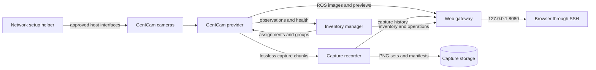

# Vixel

[](https://github.com/sn3rt/vixel/actions/workflows/ci.yml)
[](LICENSE)

Vixel is a modular ROS 2 platform for discovering, configuring, organizing, and
previewing GenICam cameras. It uses Aravis for GigE Vision and
USB3 Vision access, keeps camera identity separate from physical placement, and
provides a dynamic browser dashboard through an SSH tunnel.

> [!WARNING]
> Vixel is experimental. Network provisioning changes host interfaces and sends
> control commands to cameras. Review every configuration and dry-run before
> applying it to field hardware.

## Features

- Dynamic camera discovery with stable sensor identities.
- Automatic enrollment on explicitly approved camera networks.
- Direct-camera and switched-network port modes.
- Runtime-only GigE ForceIP assignments that preserve camera persistent settings.
- Standard and arbitrary typed GenICam feature configuration.
- ROS image, compressed preview, camera-info, inventory, and control interfaces.
- Editable location, pose, calibration, notes, and per-camera settings.
- Preview and persistent grouped capture with full-resolution PNGs and manifests.
- Coordinated software-triggered group publication with measured host dispatch span.
- Explicit degraded/strict membership policies and capture disk safeguards.
- Loopback-only web dashboard, API, snapshots, and cached image streams.

## Compatibility

| Camera type | Status | Notes |
|---|---|---|
| GigE Vision + GenICam | Supported | Primary path; tested with LUCID and IDS cameras. |
| USB3 Vision + GenICam | Experimental | Aravis transport is enabled; Vixel USB enrollment is not yet complete. |
| Vendor GenTL only | Not automatic | Requires a dedicated provider or compatible transport integration. |
| Legacy/proprietary USB | Unsupported by generic backend | For example, IDS `UI-` cameras require IDS software. |

Compatibility depends on standards compliance, supported pixel formats, and the
GenICam nodes exposed by the camera. A manufacturer or model does not need a
hard-coded Vixel entry when its GigE Vision or USB3 Vision implementation works
with Aravis.

## Architecture



The image providers and capture recorder are C++. Inventory and web components
are Python control-plane nodes. Public ROS interfaces live in
`vixel_interfaces`; new hardware families integrate through the
[provider contract](docs/provider_contract.md).

## Quick start

Vixel targets ROS 2 Lyrical on Ubuntu 26.04.

```bash
sudo apt update
sudo apt install -y linuxptp
git clone https://github.com/sn3rt/vixel.git
cd vixel
rosdep install --from-paths . --ignore-src -r -y --rosdistro lyrical \
  --skip-keys "ament_pytest gjs"
colcon build --symlink-install
source install/setup.bash
```

When using zsh, source `/opt/ros/lyrical/setup.zsh` and
`install/setup.zsh` instead of the Bash setup files.

Create a machine configuration before launching:

```bash
sudo install -d -m 0755 /etc/vixel
sudo install -m 0644 \
  install/vixel/share/vixel/config/machine.example.yaml \
  /etc/vixel/machine.yaml
sudoedit /etc/vixel/machine.yaml

ros2 run vixel_network vixel-network-setup -- \
  --machine-file /etc/vixel/machine.yaml apply --dry-run
```

After checking the dry-run, perform the one-time host service installation and
launch Vixel:

```bash
sudo env "PYTHONPATH=$PYTHONPATH" \
  "$(ros2 pkg prefix vixel_network)/lib/vixel_network/vixel-network-setup" \
  --machine-file /etc/vixel/machine.yaml install-service
ros2 launch vixel cameras_launch.py web_preview:=true
```

The installation command creates, enables, and immediately starts the managed
network and PTP services. Systemd starts them automatically on later boots.

From another computer, open an SSH tunnel and browse to
<http://127.0.0.1:8080>:

```bash
ssh -N -L 8080:127.0.0.1:8080 user@camera-host
```

The dashboard and HTTP API have no built-in authentication. Keep the gateway on
loopback and use SSH or an authenticated reverse proxy.

## Documentation

- [Installation](docs/installation.md)
- [Networking and camera provisioning](docs/networking.md)
- [Configuration and GenICam features](docs/configuration.md)
- [Operations, ROS interfaces, and HTTP API](docs/operations.md)
- [Runnable HTTP and ROS client examples](examples/README.md)
- [Troubleshooting](docs/troubleshooting.md)
- [Provider contract](docs/provider_contract.md)
- [Security policy](SECURITY.md)

## License

Vixel is released under the [MIT License](LICENSE). Third-party components keep
their own licenses; see [NOTICE](NOTICE).
